## Journal 01 - 09/21/2026 - Brainstorming and Planning
As a first step, my team (which as of right now consists of Nat, Olivia, Hanif, Nolan and myself) began by taking the time to look over the project that we were given. This is the  Game Design Education Software  with Pippin Barr, and has challenged us with creating an educational software that would allow someone with no coding experience to manipulate and create variations to a pre-existing simple game. 

As we were encouraged to begin the brainstorming period of the class, we opted to share a "Figjam" file where we began to jot down any ideas we had. Each with our colors, we laid out digital sticky notes with quickly-written thoughts on what a project like this could look like (without shying away from Figjam’s sticker options, of course).

Our Figjam board ended up being composed of multiple sections, which I will cover individually.

### Section 1 - Team
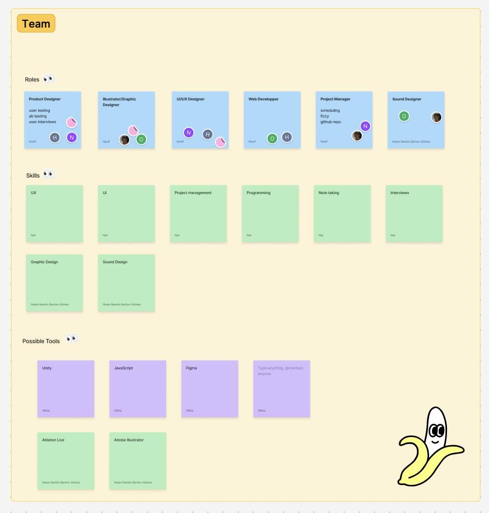

First we began by discussing our strengths and weaknesses as members, trying to decide who would most likely be taking on the roles in a project like this. At the same time, this also got us thinking about the types of work that would need to be done, and so we created sections that quickly listed the skills and tools we believed would be necessary for creating the software.

### Section 2 - “Output”
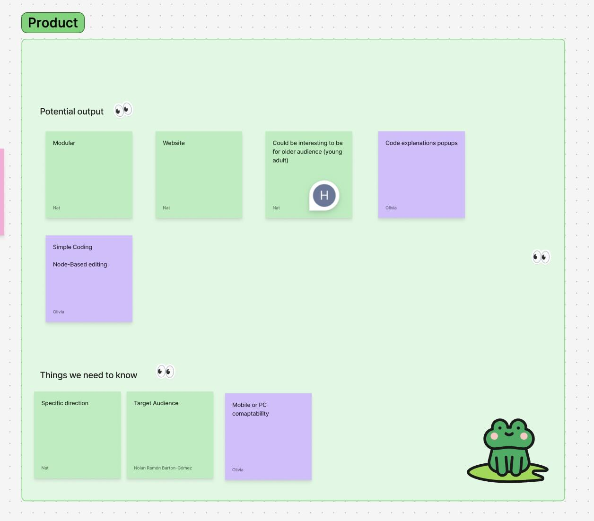

Once we got a vague idea of the type of project we’d be working on, we began deciding what we could possibly have as a final goal. As a team of five and with Pippin Barr’s suggestion for a final output seemingly being anything from an interactive Figma presentation to a working program, we decided that it would be more interesting to aim for the latter. With this came more questions than answers, however. Our main concern was that we still don’t know who our target audience is supposed to be, and this fact (that we can really only get from Pippin) will be a defining factor in which of the directions we finally go towards.

### Sections 3 - “Inspo”
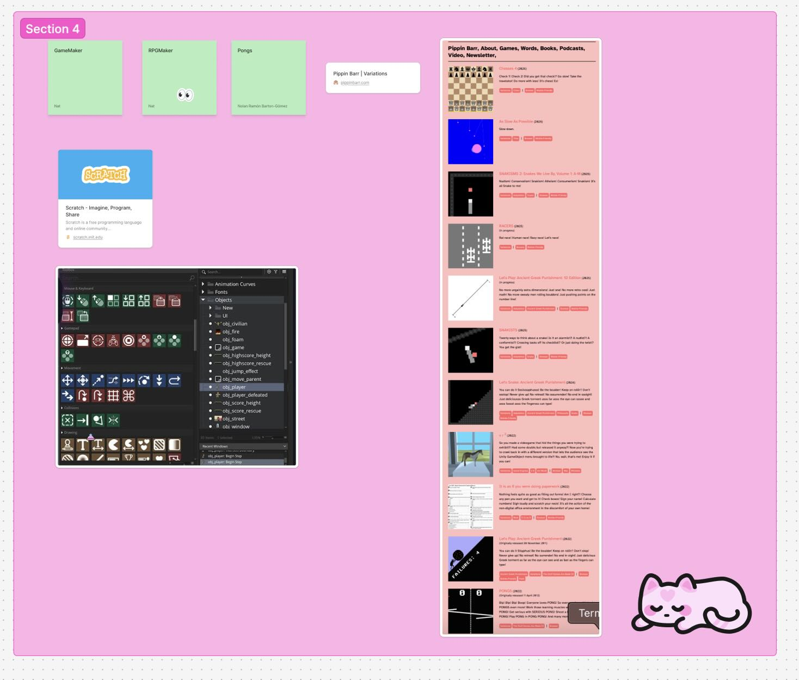

Despite us having many questions, we still continued discussing what a software of this sort could look like, and what inspirations we could use to begin problem solving. One of our teammembers, Hanif, mentioned “Scratch”; a game-building software aimed at a younger audience. Although “Scratch” is far more complex on its back-end than what we could probably achieve over the course of the class, we still decided that it would be a valuable reference for the type of software we are to produce.

Olivia brought up both gameMaker and RPG maker, which also aim at ‘simplifying’ game-making for beginners. Most interestingly is these software’s use of a sort of step-coding, which lets users visualize through images what they want to happen in their game (bottom left of image).

Finally, we also knew it would be important to reference Pippin’s own work, as he has an extensive portfolio featuring many ‘altered/varied’ versions of popular simple games.

### Section 4 - “Feedback”

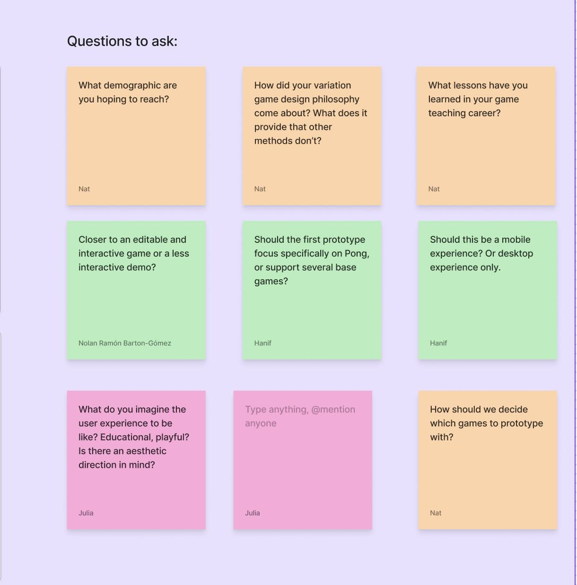

During the entire discussion, we made sure to take notes of which questions we wanted to ask our client when we saw him next week. We were mostly interested in the aforementioned “target audience” of the project, as well as some more personal questions that would allow us to hopefully better understand his design philosophy, and allow us to create something that aligns with it in return.

### Final Thoughts

After presenting, it was pointed out that we have a large advantage when approaching this project: all of us in the class learnt coding in an academic setting, and can use our experience of what we “wished we could have had” to help guide our choices. I’m looking forward to seeing how our varying skills and creative ideas shape this project!

## Journal 02 - 09/21/2026 - Ideation
### The First Client Meeting
Last week was our team’s first time meeting with Pippin Barr in order to begin discussing what his goals were for the projects, as well as his expectations. The conversation mainly focused on his philosophy on gaming, as the software we are supposed to develop is directly linked to the ideologies in the book he is working on titled Playing the Variation Game. 

He explained that the most important aspect of what we create has to be its ability to make the player think in an unconventional way. That is, it must allow players to approach game-making from an experimental, unconventional angle that separates itself from the usual rigidity that is learning to code. Preferably embracing the weird and wacky, the software will allow those to experiment with creating games, and variations of games, in order to experience the process of “Game-Making” without needing to code. In short, it is a wacky, experimental sort of software that puts the ‘game’ back into ‘game-making’.

### Ideation
After our meeting, we decided that as a group it would be best if we individually came up with our own designs, and then presented them to each other the week after. This would allow for all of us to come in with unique ideas that aren’t influenced by one another yet. 

As my own personal goal, I knew I wanted to really focus on the ‘unconventionality’ of the software, starting with the visuals. As of now, I believe that creating unique visuals will naturally lead into unique functionality. 

To do this, I wanted to start by breaking the standard rectangular space that most software assumes since, of course, our screens are rectangular. I thought, then, well is there anything that already does that? The answer I came up with was … yes! Early 2000-2010s window media/audio players were often wacky, strange shapes, but still maintained a level of functionality that allowed the user to use the button interface to play/stop/fastforward and sometimes even manipulate the audio further.

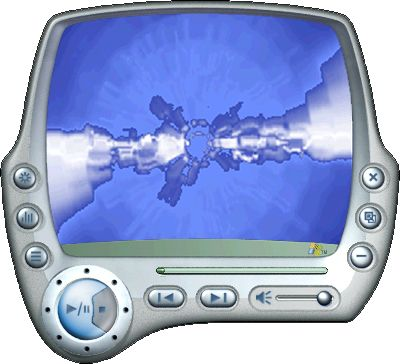
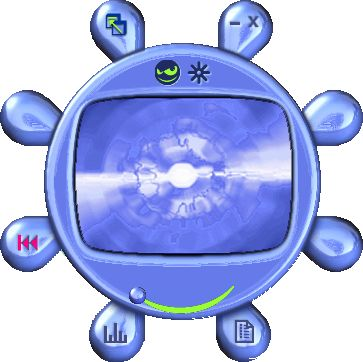
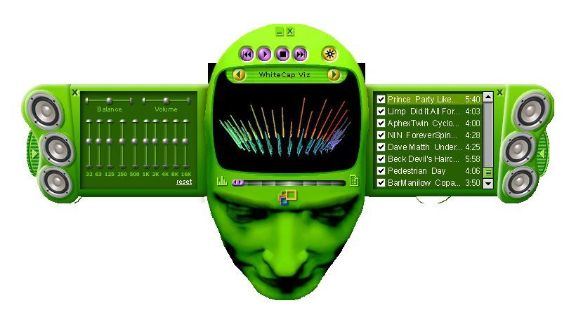

### Photo-bashes

With these ideas in mind, I continued by doing some photo-bashing. Without concentrating too much on the details, I wanted to create some quick ideas that would allow me to get a feeling for what we are designing.

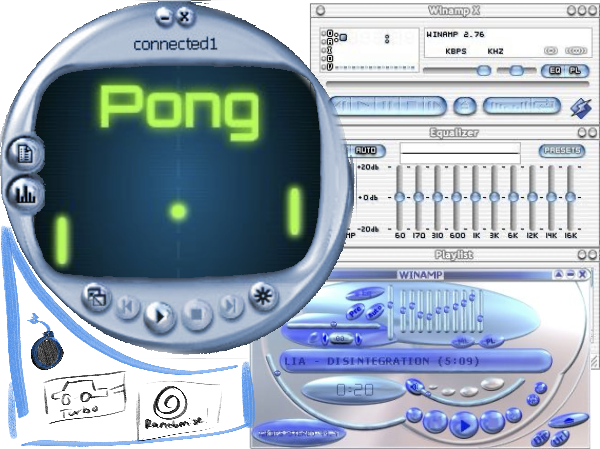
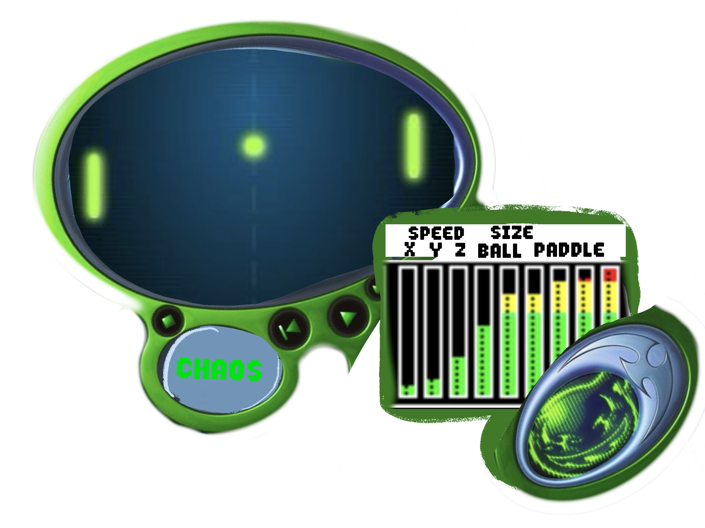

The various buttons and levers, while taken from photos of media players, would instead correspond to various attributes of the chosen game, and would theoretically vary depending on the game chosen. I also like the idea of some of the controls being obvious, but others being more ambiguous, such as the ‘chaos’ button in the second photo-bash, which imply an unexpected outcome. This would, in theory, force players to interact with the media out of curiosity, and create some surprising results, without worrying too much about making the game ‘good’.

## Journal 03 - 10/06/2026

### The Group Meeting + Meeting Notes
After the first milestone meeting last week, our team decided it would be essential to have a meeting where we decided on the next steps to take in the design of the software. We knew we needed several things in order to progress: A user flow, wireframe and a more solid grasp on the aesthetic direction we wished to take. 

In order to better organize ourselves, we added onto the shared Figjam file, agreeing to each share our work from the week there so that we could easily flip between each-others progress. We added a section here where we would take note of the discussions during our meetings, and where we would assign what cards would go to who on the Fizzy Kanban. 
Each member was assigned a task, as well as the responsibility to add to a shared 'Moodboard" that would be ongoing, where we are to add inspiration. For me, the results of this meeting was that I would be responsible for the visual pitches, going off of what we presented last week. We decided to stick to the wacky/unconventional design language. I was to work with Olivia on this, as we contributed the most last week to the brainstorming of the visual aspects.
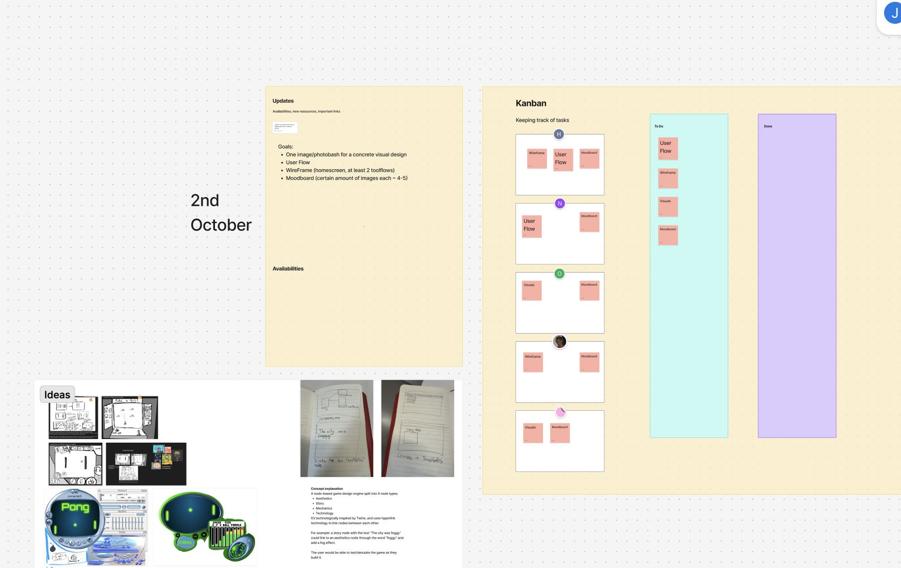
### The Moodboard
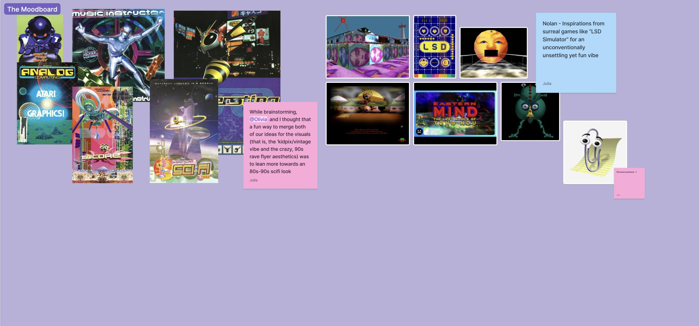
This is the aforemnetioned moodboard, where Olivia and I added some of the inspiration that we pulled from creating the visual pitches. As we looked over last weeks ideas, we found there was a possible overlap between our two designs, deciding to mix my "2000s audio player" inspirations with her "wacky retro" vibe, culminating into one design idea that would lean more towards a retro game look. This is what we explained in the images added onto the board. As you can see, some other images were also added by Nolan, instead suggesting leaning more into the surreal and possibly incoporating a 'digital assistant' sort of character.
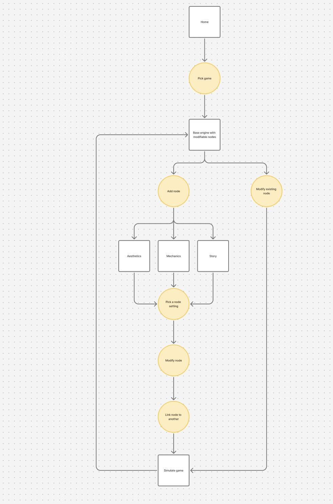
### Wireframe and user Flow
Nat was responsible for the above user flow, which was then handed over to Hanif, who worked largely on the wireframe. The two collaborated in order to have the two steps work well with one another and create a cohesive idea for /how/ this software would theoretically work interface wise.
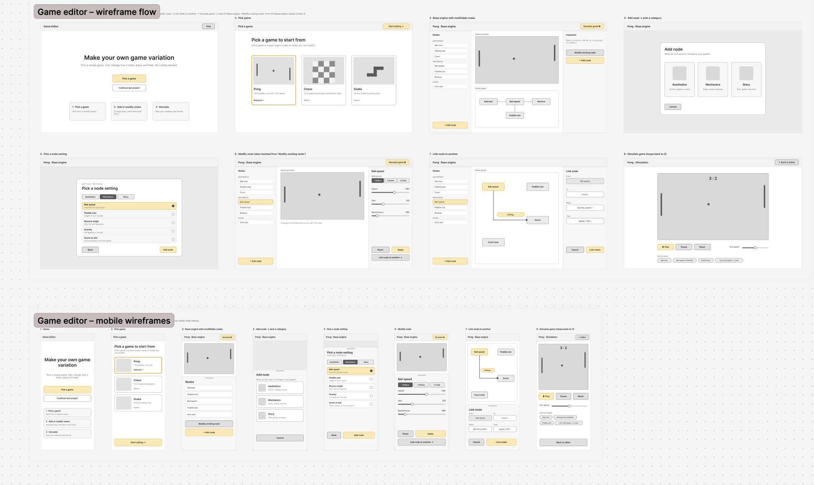
Above is the Wireframe made by Hanif.
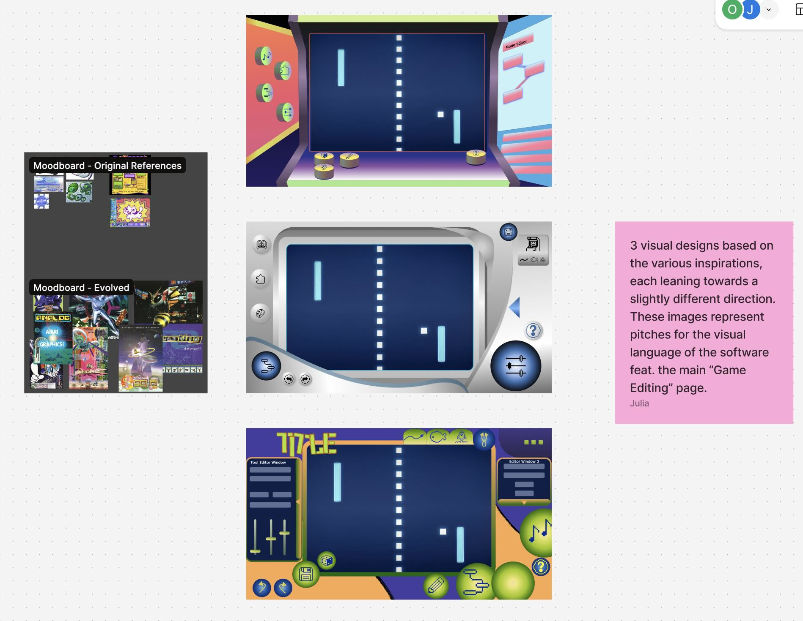
Finally, after looking at Hanif's wireframe and Nat's work ont the User Flow, Olivia and I worked on creating 3 varying visual pitches. For the designs, we focused on the 'main' page that the user would be using, that is to say the "game Editing" page. Referencing our other team member's work, we tried to imagine how these different tools and pages would be accessed while also pushing the imagery into an unconventional direction. Our first one leaning heavily into the aforementioned retro-game style, the second more into the original '2000s' style, and the third into the 'Kid-Pix' design that Pippin mentioned during our first meeting.

### Final Notes
Unfortunately, we were having a difficult time getting hold of Pippin, and had to continue with our design without his input. However, we are hoping to arrange two more meetings with him before the midterm. So far, the unconventional elements have been enjoyable to experiment with, and once the visual style is confirmed, it will be even more itneresting to start implementing some of the functionality.

